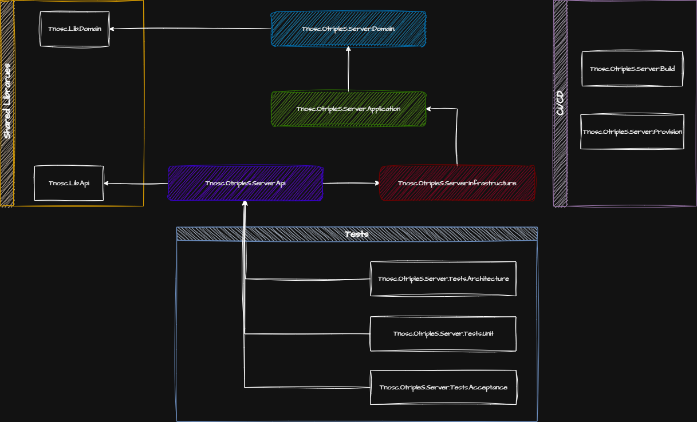

# Otriples.Server

I created this repository as a hands-on exercise to apply and practice [the standards proposed by Hassan Habib](https://github.com/hassanhabib/The-Standard).
The goal is to rewrite the [OtripleS](https://github.com/hassanhabib/OtripleS) project while following the latest version of the Standards, since the original project is no longer actively updated.

This repo is mainly for learning, experimenting, and contributing to the Standards community while building a clean, maintainable, and testable backend project.

## 🧱 Key Architectural Choices

- **Clean Architecture**  
  This project follows **Clean Architecture principles**, ensuring a clear separation of concerns, testability, and maintainability.

- **Layered Projects**  
  Each layer (API, Application/Services, Domain, Infrastructure) is placed in a **separate project** within the solution. This enforces strict boundaries between layers and keeps dependencies flowing in the right direction.

- **Handling Exceptions in Brokers** 

  In this project, brokers handle exceptison by mapping external exceptions to local exceptions.  
  This approach slightly deviates from [Hassan Habib’s standards](https://github.com/hassanhabib/The-Standard/blob/master/1.%20Brokers/1.%20Brokers.md#122-no-exception-handling) but ensures that the application layer remains decoupled from external dependencies by only dealing with local exceptions.

- **Request-Response Pattern (REPR)**  
  This project follows the **Request-Response (REPR) pattern**, where each endpoint handles a single request and returns a response.  
  By doing so, this approach **enforces the Single Responsibility Principle (SRP)**, as each endpoint is responsible for only one action.


## Project Structure



- **/src**: Main source code directory
  - **/Tnosc.OtripleS.Server.Api**: Exposes the Web API endpoints and handles HTTP requests/responses.
  - **/Tnosc.OtripleS.Server.Application**: Contains business logic.
  - **/Tnosc.OtripleS.Server.Domain**: Defines entities.
  - **/Tnosc.OtripleS.Server.Infrastructure**: External dependencies and persistence.

- **/lib**: Shared libraries
  - **/Tnosc.Lib.Api**: Contains reusable API helpers, extensions, and common request/response utilities.
  - **/Tnosc.Lib.Domain**: Contains shared domain abstractions.

- **/tests**: Contains all test projects
  - **/Tnosc.OtripleS.Server.Tests.Acceptance**: Contains acceptance tests verifying end-to-end functionality.
  - **/Tnosc.OtripleS.Server.Tests.Architecture**: Contains architecture tests ensuring adherence to design principles and layer boundaries.
  - **/Tnosc.OtripleS.Server.Tests.Unit**: Contains unit tests for services and endpoints.

- **/devops**: DevOps and deployment projects
  - **/Tnosc.OtripleS.Server.Build**: Generates YAML scripts for build and provision pipelines.
  - **/Tnosc.OtripleS.Server.Provision**: Creates and provisions Azure resources for different environments.


## 📚 Running the Project

To run the project locally:

```bash
git clone https://github.com/TNOSC/OtripleS.Api.git
cd OtripleS.Api/src
dotnet restore
dotnet run
```

Alternatively, you can run the project using Docker Compose:

```bash
git clone https://github.com/TNOSC/OtripleS.Api.git
cd OtripleS.Api/src
docker-compose -f docker-compose.yml -p tnosc-otriples-server up -d
```
Once the application is running, you can explore and test all available endpoints via Swagger at:
```bash
http://localhost:5000/swagger
```

## 📦 NuGet Packages

- **Entity Framework Core**: ORM for database access with clean separation of persistence concerns.
- **ASP.NET Core**: Web framework for building REST APIs (Minimal APIs are being used).
- **Swagger/OpenAPI**: Generates API documentation with an interactive, testable UI.
- **RESTFulSense**: Provides utilities and helpers to simplify REST API development and testing.
- **NetArchTest.Rules**: Enables automated architecture tests to ensure code adheres to design rules.
- **NSubstitute**: Lightweight mocking framework for unit testing in .NET.
- **Shouldly**: Assertion framework for more readable and expressive unit tests.
- **Tynamix.ObjectFiller**: Generates test data for objects, useful in unit and integration testing.
- **xUnit**: Testing framework for .NET for writing and executing unit tests.
- **ADotNet**: Helper library for .NET build pipelines and deployment automation.
- **Azure.ResourceManager**: SDK for managing Azure resources programmatically in .NET.

## 🛠️ Development Configuration

The project includes several configuration files that help standardize development practices and maintain code quality:

- **.editorconfig**: Ensures consistent coding styles across editors and IDEs
  - Defines tab/space preferences, line endings, and trailing whitespace rules
  - Configures C# code style and formatting conventions
  - Sets severity levels for code analyzers

- **Directory.Build.props**: Centralizes common build settings for all projects
  - Enables nullable reference types, implicit usings, and treats warnings as errors
  - Integrates code analyzers (SonarAnalyzer) to enforce best practices
  - Applies code style rules during build

- **Directory.Packages.props**: Manages NuGet package versions centrally
  - Ensures consistent package versions across all projects
  - Simplifies version updates by changing them in a single location


## 📖 Inspiration

This project is heavily inspired by:

- [OtripleS](https://github.com/hassanhabib/OtripleS)
- [Hassan Habib’s Standards](https://github.com/hassanhabib/The-Standard)
- [Hassan Habib’s Coding Standards](https://github.com/hassanhabib/CSharpCodingStandard)
